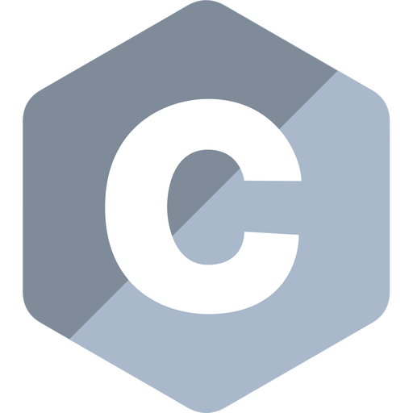
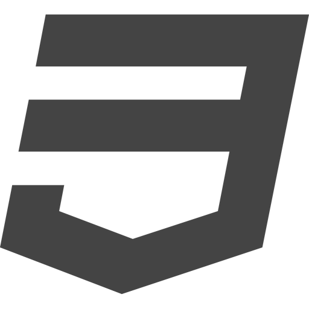

<h1 align="center"> Hi there, This is Tanishq Rajesh Jain  </h1>

🇮🇳  &nbsp; I am from Surat, Gujarat, India  
👨‍🎓 &nbsp; I am currently pursuing my undergrad from National Institute of Technology, Kurukshetra  
💻 &nbsp; I have a keen passion in learning about newer technolgies in the field of software development.  
🖥️ &nbsp; I have made few projects in the field of website development.

<h2> Programming Languages </h2>

<h2> My Profiles </h2>

 

